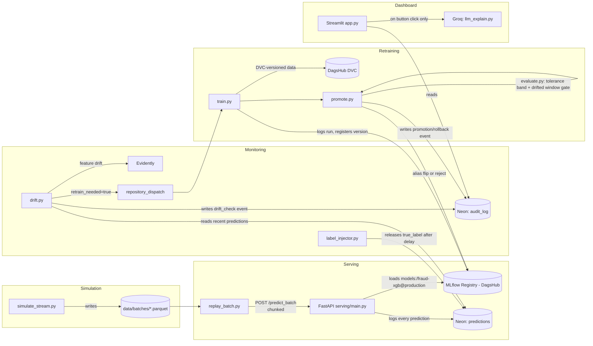

# Continuous Fraud Detection Pipeline

A portfolio MLOps project demonstrating registry-based model governance, drift-triggered continuous retraining, automated promotion gating, and automated rollback with a full audit trail. The fraud model itself (XGBoost, CPU-only) is deliberately simple, the point of this project is the lifecycle automation around it, not model quality.

Built entirely on free-tier infrastructure: [DagsHub](https://dagshub.com) (DVC + MLflow), [Neon](https://neon.tech) (Postgres), [GitHub Actions](https://github.com/features/actions) (CI/CT orchestration), [Evidently](https://www.evidentlyai.com) (drift detection), [Logfire](https://logfire.pydantic.dev) (tracing), and [Groq](https://groq.com) (a single isolated LLM call).

## What this demonstrates

- **Registry-based governance**, the API always serves whatever model is aliased `production` in the MLflow registry; promotion is an alias flip, not a redeploy.
- **Drift-triggered retraining**, no cron-scheduled retraining. A challenger is only trained when Evidently detects feature drift or rolling performance drops past a threshold.
- **Two-sided evaluation gate**, a challenger must not regress beyond a tolerance band on a frozen holdout set (guards against forgetting the original distribution) *and* must strictly improve on the recent drifted window (guards against ignoring the new pattern). Both conditions are enforced, not heuristically blended.
- **Automated rollback**, if a newly promoted champion underperforms in subsequent batches, the alias reverts automatically, restoring the previous champion's actual baseline metrics, not just its version number.
- **End-to-end observability**, every drift check, gate decision, promotion, and rollback is written to an audit log in Postgres and traced via Logfire.

## The simulated-stream design choice

The [ULB Credit Card Fraud dataset](https://www.kaggle.com/datasets/mlg-ulb/creditcardfraud) (~285k transactions, 30 PCA-anonymized features, ~0.17% fraud) is static. To exercise a *continuous* pipeline, `data/simulate_stream.py` replays it as a sequence of batches representing days:

- A stratified **frozen holdout** (15%) is carved out first, before any drift injection, this is the pristine reference set the evaluation gate checks against.
- The remaining rows are split into 100 sequential batches. The first 10 are reserved as **pretrain material** (used to bootstrap the first champion, never replayed as "live" traffic).
- **Feature drift** is injected as a persistent shift + scale on `V1`, `V2`, `V3` starting at batch 30, it doesn't turn off.
- **Concept drift** is injected in batches 45-54: fraud-row features are blended toward the legitimate-transaction centroid, so the decision boundary a model learns genuinely shifts. Labels are never touched, this isn't label noise, it's the same fraud pattern becoming harder to distinguish from legitimate activity.
- Ground-truth labels are withheld from training/evaluation until `LABEL_DELAY_BATCHES` (5) batches after prediction, mirroring real-world fraud-label lag.

This is a deliberate simplification, not a hidden shortcut, every drift event is scripted, logged to `data/batches/manifest.json`, and this section exists so it's never mistaken for a claim of real production traffic.

## Architecture
 


## Repo structure

```
.
├── config.py                     # all thresholds, paths, drift schedule in one place
├── requirements.txt
├── pytest.ini                    # pythonpath=. so `from src.x import y` resolves everywhere
├── ruff.toml                     # ignores E402: sys.path.append-then-import is deliberate
├── .env.example
│
├── data/
│   └── simulate_stream.py        # holdout split + batch generation + drift injection
│
├── src/
│   ├── train.py                  # trains challenger, recency-weights recent batches
│   ├── evaluate.py               # pure gate logic: no MLflow client, no DB writes
│   ├── promote.py                # orchestration: alias flip, rollback, audit logging
│   ├── drift.py                  # Evidently feature drift + rolling performance drift
│   └── label_injector.py         # releases delayed ground-truth labels into Neon
│
├── serving/
│   ├── main.py                    # FastAPI, loads whichever model is aliased "production"
│   ├── schemas.py                 # request/response models, built from config.FEATURE_COLUMNS
│   └── db.py                      # all Neon access: predictions, audit_log, pipeline_state
│
├── dashboard/
│   ├── app.py                     # drift charts, promotion history, on-demand explanations
│   └── llm_explain.py             # single isolated stateless Groq call
│
├── scripts/
│   ├── advance_day.py             # the pipeline's actual clock (not GH Actions cron)
│   └── replay_batch.py            # replays one simulated day of traffic through the API
│
├── tests/                        # unit tests only, pure functions, no DB/API/model calls
│
└── .github/workflows/
    ├── ci.yml                     # lint + unit tests, every push
    ├── monitor.yml                # advance day, replay, label, drift check, dispatch
    └── retrain.yml                # train, evaluate, promote (fired by monitor.yml)
```

## Why the clock isn't GitHub Actions cron

`monitor.yml` has a `schedule` trigger, but GitHub Actions cron is explicitly best-effort, it can be delayed or skipped, especially on low-activity repos. The simulated "current day" is a counter stored in Neon (`pipeline_state.current_batch`), advanced by `scripts/advance_day.py`. Use `workflow_dispatch` for reliable, on-demand runs; treat the cron trigger as a nice-to-have, not the source of truth.

## The evaluation gate

`src/evaluate.py` implements two checks (`run_gate`), both required to pass:

| Check | Rule | Why |
|---|---|---|
| Frozen holdout | Challenger's recall/precision within `HOLDOUT_TOLERANCE` (5%) of champion's | A hard "must beat" requirement here would make promotion impossible after genuine concept drift, a model correctly adapting to a new pattern will legitimately look slightly worse on the old distribution. |
| Recent drifted window | Challenger strictly dominates champion (no worse on either metric, strictly better on at least one) | This is where the challenger has to earn its promotion, no regression tolerated on the window that motivated retraining in the first place. |

Promotion also requires at least `MIN_FRAUD_COUNT_FOR_PERF_CHECK` (20) labeled fraud cases in the recent window, with ~0.17% fraud, a small window can otherwise produce a noisy recall/precision estimate that isn't meaningful.

## Setup

1. **Clone and install**
   ```
   git clone https://github.com/abhinavharbola/sentinelML.git
   cd fraud-mlops-pipeline
   pip install -r requirements.txt
   ```

2. **Get the dataset.** Download `creditcard.csv` from [Kaggle](https://www.kaggle.com/datasets/mlg-ulb/creditcardfraud) into `data/raw/`.

3. **Provision free-tier services**, then copy `.env.example` to `.env` and fill in:
   - [Neon](https://neon.tech), create a project, copy the connection string to `NEON_DATABASE_URL`.
   - [DagsHub](https://dagshub.com), create a repo, use its MLflow tracking URL for `MLFLOW_TRACKING_URI`, and your DagsHub username/token for `MLFLOW_TRACKING_USERNAME`/`MLFLOW_TRACKING_PASSWORD` and `DAGSHUB_USERNAME`/`DAGSHUB_TOKEN`.
   - [Groq](https://console.groq.com), API key for `GROQ_API_KEY`.
   - [Logfire](https://logfire.pydantic.dev), project token for `LOGFIRE_TOKEN`.
   - `API_URL`, where you deploy `serving/main.py` (Render or Hugging Face Spaces free tier); `http://localhost:8000` for local dev.

4. **Set up DVC against DagsHub** (one-time, local):
   ```
   dvc init
   dvc remote modify origin --local auth basic
   dvc remote modify origin --local user <DAGSHUB_USERNAME>
   dvc remote modify origin --local password <DAGSHUB_TOKEN>
   ```

5. **Generate the simulated stream**
   ```
   python data/simulate_stream.py
   dvc add data/raw/creditcard.csv data/raw/frozen_holdout.parquet data/batches
   dvc remote default origin
   dvc push -j 1 -v
   ```

6. **Add the same secrets to your GitHub repo** (Settings → Secrets and variables → Actions): `NEON_DATABASE_URL`, `MLFLOW_TRACKING_URI`, `MLFLOW_TRACKING_USERNAME`, `MLFLOW_TRACKING_PASSWORD`, `DAGSHUB_USERNAME`, `DAGSHUB_TOKEN`, `GROQ_API_KEY`, `LOGFIRE_TOKEN`, `API_URL`, and `DISPATCH_TOKEN` (a personal access token with `repo` scope, used by `monitor.yml` to fire `repository_dispatch`).

## Running it

**Bootstrap the first champion:**
```
python src/train.py
python src/promote.py promote --challenger-version 1
```
The first promotion has no existing champion to compare against, so `promote.py` bootstraps unconditionally and seeds the baseline from the challenger's own holdout performance.

**Serve locally:**
```
uvicorn serving.main:app --reload
```

**Reproduce a drift-triggered retrain end to end**, either locally or via `workflow_dispatch` on `monitor.yml`:
```
python scripts/fast_forward.py 25   # advance + replay + release labels, 25 simulated days at once
python src/drift.py                 # should now report retrain_needed=true (past batch 30 = feature drift)
```
`fast_forward.py` exists because doing this one `advance_day.py` call at a time to reach batch 30+ is tedious and, worse, incomplete on its own, jumping the day counter without replaying each day's traffic leaves the recent window with no predictions for `drift.py` to analyze. It runs the real `advance_day.py` → `replay_batch.py` → `label_injector.py` functions directly (not a reimplementation) for each simulated day.
Once `drift.py` reports `retrain_needed=true`, `monitor.yml` fires `retrain.yml` automatically via `repository_dispatch`. To trigger it manually instead:
```
python src/train.py
python src/promote.py promote --challenger-version <version from train.py output>
```

**View the dashboard:**
```
streamlit run dashboard/app.py
```